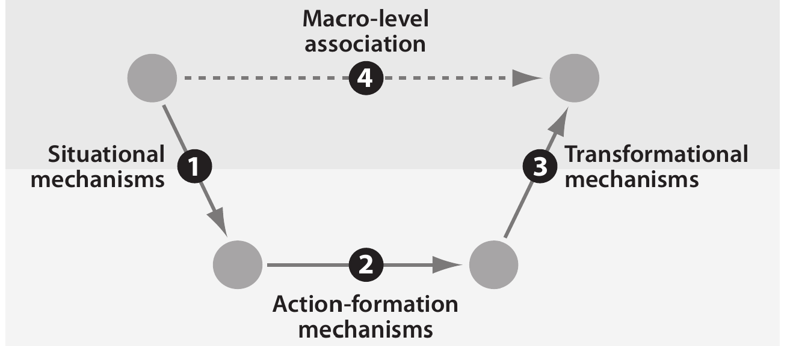

```{r xaringan-themer, include=FALSE, warning=FALSE}
#This block contains the theme configuration for the CSS lab slides style
library(xaringanthemer)
library(showtext)
style_mono_accent(
  base_color = "#5c5c5c",
  text_font_size = "1.5rem",
  header_font_google = google_font("Arial"),
  text_font_google   = google_font("Arial", "300", "300i"),
  code_font_google   = google_font("Fira Mono")
)
```

```{r setup, include=FALSE}
options(htmltools.dir.version = FALSE)
```

layout: true

<div class="my-footer"><span>David Garcia - Computational Modelling of Social Systems</span></div> 

---


# About me

.pull-left[
.center[
```{r, echo=FALSE, out.width=270}
knitr::include_graphics("Profile.jpg")
```
]]

.pull-right[
<br>
Website: [dgarcia.eu](https://dgarcia.eu)

Twitter: [@dgarcia_eu](https://twitter.com/dgarcia_eu)

Github: [dgarcia-eu](https://github.com/dgarcia-eu)

Email: david.garcia@uni-konstanz.de
]

- Professor for Computational Behavioral and Social Sciences, TU Graz
- Professor for Social and Behavioral Data Science, University of Konstanz
- Faculty member of the Complexity Science Hub Vienna
- Privatdozent at ETH Zurich

---
background-image: url(VennV2-1.svg)
background-size: 97%
---
background-image: url(VennV2.svg)
background-size: 97%
---

## Research lines
```{r, echo=FALSE, out.width=1000, fig.align='center'}
knitr::include_graphics("Topics3.svg")
```

---
background-image: url(AboutUS.svg)
background-size: 98%
---

# Overview

## 1. Complex Social Behavior

## 2. Agent-Based Modelling (ABM)

## 3. ABM Example: Date Choice Model

## 4. About this Course

---


# Complex Social Behavior

## *1. Complex Social Behavior*

## 2. Agent-Based Modelling (ABM)

## 3. ABM Example: Date Choice Model

## 4. About this Course


---

## Complex social behavior example: Polarization
```{r, echo=FALSE, out.width=650, fig.align='center'}

```

- Two opposing groups can become more extreme due to their perception of the behavior and opinions of the other group. 
- Individuals in isolation do not naturally tend to opinion extremes.
---

## Complex social beavior example: Bank runs
```{r, echo=FALSE, out.width=600, fig.align='center'}

```
- Banks operate without all the savings in their reserves
- If customers believe that many others withdraw their money, they will do it too
- The rumor and spreading distrust is necessary, customers in isolation would not create a bank run (tragedy of the commons)
---

## Complex social beaviors: Activation and inhibition

```{r, echo=FALSE, out.width=900, fig.align='center'}
knitr::include_graphics("Figures/Crowd.jpg")
```

- Individuals demonstrating in isolation are peaceful, but in a group a riot can emerge without a clear antecedent
- People alone in the street offer help, but when many are watching they don't act (bystander effect)

---

# The macro-micro gap

```{r, echo=FALSE, out.width=900, fig.align='center'}

```

*Causal Mechanisms in the Social Sciences. Peter Hedström and Petri Ylikoski. Annual Review of Sociology, 2010.*
---

## Interdisciplinarity in complex social behavior
```{r, echo=FALSE, out.width=1200, fig.align='center'}
knitr::include_graphics("Figures/Interdisciplinarity.svg")
```

---

# Agent-Based Modelling (ABM)

## 1. Complex Social Behavior

## *2. Agent-Based Modelling (ABM)*

## 3. ABM Example: Date Choice Model

## 4. About this Course

---

# Agent-Based Modelling (ABM)

- Agent-Based Model: A computational analogy of a social system that is composed of a set of agents that represent *discrete* individuals

- Agents have internal states, perceive the actions of other agents, and interact with other agents and their environment (*situated*)

- Agents are *active*: they have a behavioral repertoire, are not just particles

- Agents might have access only to *limited informtion* in their environment

- Agents might have *internal goals* that determine their behavior and can *adapt* to the behavior of other agents or the environment

*Agent-Based Modeling: A New Approach for Theory Building in Social Psychology. Eliot Smith and Frederica Conrey, 2007*

---

# Explaining behavior with ABM

- Observed collective behavior or effects are *explananda*: empirical facts that are missing an explanation.
  - Example: hotter days have higher average crime rates

- ABM offer *explanations*: theories that generate the observed behavior and link it to other empirical facts
  - Example: heat makes people be longer in the street, facilitating crime

- ABM are part of a larger theoretical approach called *Analytical Sociology*, where everything in a model of social behavior must be explicit
  - Example: coding a simulation of people going out depending on temperature and crimes happening outdoors
  
---

# Explaining behavior with ABM

**ABM do not provide empirical evidence**
  - Simulation results alone are not evidence that humans behave in one way or another. Beware of causal conclusions based on ABM alone!

  - They can **generate hypotheses**, for example on the consequences of policies in simulations or formulate predictions

  - They can **reconcile empirical observations** across individual behavior and collective behavior levels

  - They are a way to **analyze theory**, showing necessary or sufficient conditions for some collective behavior to emerge
  
---

## Computational theory instead of exploration

**ABM are for analysis, not just exploration**

- Exploring what happens in a simulation is fine, but ABM can do much more!

- **Behavior calibration** of individual agents with experiments or surveys: integrating social and behavioral findings in an ABM

- **Analysis of observable outcomes** versus parameters of behavior or alternative mechanisms/policies

- **Testing outcomes** with large-scale data (e.g. digital traces from computational social systems), across conditions and over time

*From factors to actors: Computational Sociology and Agent-Based Modeling. Michael Macy and Robert Willer. Annual Review of Sociology, 2002.*

---

# Properties of good ABM

- They **model causation**: agent actions and conditions have counterfactuals and dynamics are not ad hoc to get an outcome


- They have **measureable outcomes:** collective behavior can be aggregated into one or more quantities that can be measured in many simulations and across conditions

- They have **quantifiable designs:** individual dynamics are based on metrics that can be tested with empirical methods (e.g. experiments, surveys)

- Are **minimal and modular:** you can test the sensitivity of outcomes with different blocks of dynamics and include only what is necessary

---

# ABM Example: Date Choice Model

## 1. Complex Social Behavior

## 2. Agent-Based Modelling (ABM)

## *3. ABM Example: Date Choice Model*

## 4. About this Course
---
## Date choice in computational social systems

.pull-left[]

---

## Date choice in computational social systems

.pull-left[]

.pull-right[</br></br></br>]
---

# The question of attractiveness matching

- Example: Kalick and Hamilton (1986) date choice model

-   Question: do people seek dating mates that are as attractive as possible or matching their own perceived attractiveness?
  
- Conflicting evidence: 
  - In experiments (micro), participants seek to maximize partner attractiveness, participant attractiveness is barely relevant
  - In observational data (macro), attractiveness of couples are   correlated  
  ( $r \sim 0.6$ ) and correlation is stronger for more committed couples

*The matching hypothesis reexamined. Michael Kalick and Thomas Hamilton. Journal of Personality and Social Psychology, 1986.*
---

# The Kalick and Hamilton dating model

- Start with N male and N female agents, all are uncoupled

- Each agent has a constant attractiveness number randomly sampled between 1 and 10 at the beginning of the simulation

- Repeat while there are uncoupled agents:

  - All male and female agents are randomly paired for a date

  - Dates consist on each individual accepting or rejecting their     partner. Probability of accept is based on a rule taking into account their attractiveness levels (e.g. matching or seeking attractiveness)

  - Dates with both agents accepting form a couple and leave the dating pool


---

# Model metrics

1. Model "time" $t$: Percentage of agents that are in a couple
  - It grows with simulation iterations, starting from $0$ and approaching $100$
  
2. Correlation coefficient between paired couples ( $r_t$ ) at time $t$:
  - $r_t = r(M_t, F_t) = \frac{\sum_{c \in C_t}(m_c - \mu_{M_t})(f_c - \mu_{F_t})}{\sqrt{\sum_{c \in C_t}(m_c - \mu_{M_t})^2(f_c - \mu_{F_t})^2}}$
  - $M_t$ and $F_t$ are the vectors of male and female attractiveness in couples formed up to time $t$, denoted as $C_t$ 

3. Mean attractiveness of the $N_t$ paired couples at time $t$: 
  - $\mu_t = \mu_{M_t} + \mu_{F_t} = \sum_{c \in C_t}  (m_c+f_c) / N_t$


---

# Seeking similar match: outcomes

.pull-left[
```{r, echo=FALSE, out.width=550, fig.align='center'}

```
]
.pull-right[

- Outcomes over simulation time (% matched couples) for the case of seeking similar partners

- Correlation starts very high (0.8)

- No real trend in correlation

- Mean couple attractiveness is around the average the whole simulation


]

---

# Maximizing partner attractiveness

.pull-left[
```{r, echo=FALSE, out.width=550, fig.align='center'}
knitr::include_graphics("Figures/preference.png")
```
]
.pull-right[

- Outcomes over simulation time (% matched couples) for the case of preferring attractive partners regardless of own attractiveness

- Correlation starts low but raises pretty fast up to about 0.55

- Mean couple attractiveness starts much above average and approaches average

- Attractive agents couple earlier
]

---

# Results of dating model

- **Main result:** attractiveness matching is not necessary for observed correlations, they can be produced by attractiveness seeking alone.

- ABM reconciles apparently conflicting empirical results

- **Comparison with empirical data:** observed empirical correlation is closer to 0.55 than to 0.9
  - This could also be due to measurement error in attractiveness 
  
- **Many simplifications** 


*The matching hypothesis reexamined. Michael Kalick and Thomas Hamilton. Journal of Personality and Social Psychology, 1986.*

---


# About this Course 

## 1. Complex Social Behavior

## 2. Agent-Based Modelling (ABM)

## 3. ABM Example: Date Choice Model

## *4. About this Course*
---

# Course objectives

Upon the completion of this course, students will be familiar with the following:

- Various approaches to model social interactions to bring the micro-macro gap

- General principles of agent-based modelling and network modelling

- The analytical approach to formalization, simulation, and analysis of computational models

- The role of empirical data in the calibration and validation of computational
models

- The limitations and applications of computational modelling in the social
sciences


---

# Course calendar

1. Basics of agent-based modelling: the micro-macro gap (24.10.2022)
2. Modelling segregation: Schelling's model (31.10.2022)
3. Modelling cultures: Axelrod's model (07.11.2022)
4. Basics of spreading: Granovetter's threshold model (14.11.2022)
5. Opinion dynamics (21.11.2022)
6. Modelling small worlds (28.11.2022)
7. Scale-free networks (05.12.2022)
8. Resilience in social networks (12.12.2022)
9. Growth processes and spreading in networks (19.12.2022)
10. Student presentations (09.01.2023)
11. Student presentations (16.01.2023)
12. Student presentations (23.01.2023)
13. Student presentations (30.01.2023)
14. Student presentations (06.02.2023)

---
# Course assessment

Students select a published article from a set of readings to present in the second part and to
write a *review of the article* as final report. 

The course grade is based on:
- the student presentation (50%)
- participation in discussions after each presentation (20%)
- and on the report (30%)

Coding is not necessary but reimplementing a model from a paper is a great start to present it. This is not a required step: some models might be too complicated or require unavailable data.

The course does not include coding exercises, feel free to use any language.

---

# Summary

1. **Complex Social Behavior**
  - Humans behave differently in groups as in isolation: collective behavior
  - Interdisciplinary approach to explain macro dynamics from micro behavior
2. **Agent-Based Modelling (ABM)**
  - A computational approach to formalize and analyze social systems
  - Agent properties and model objectives and assumptions
3. **ABM Example: Date Choice Model**
  - Mismatch in empirical results: observations contradict experiments
  - A simple model shows that seeking attractiveness in a finite dating pool also generates the observed correlations in couples
4. **About this Course**
  - ABM basics, opinion dynamics, network models, behavior on networks
  - Readings-based, student presentations of existing papers in ABM
