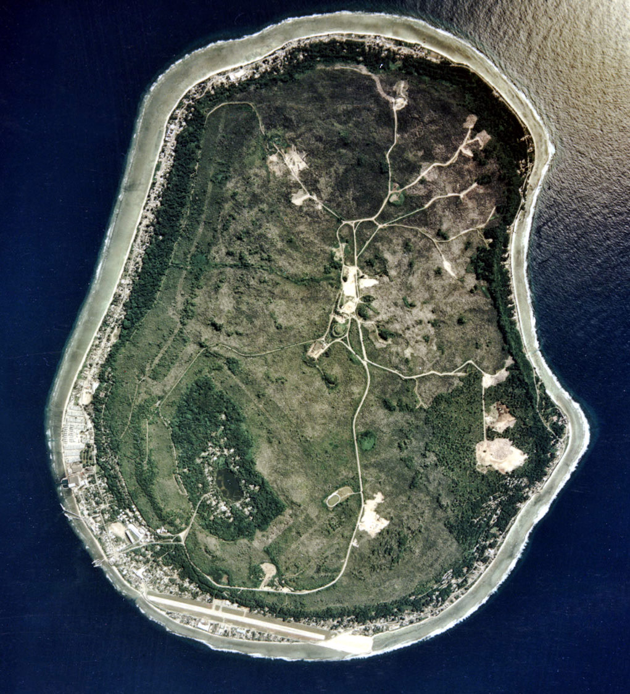
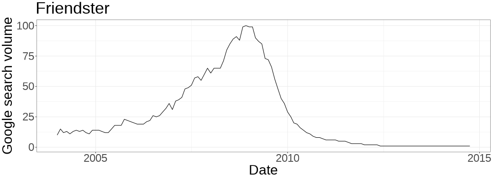
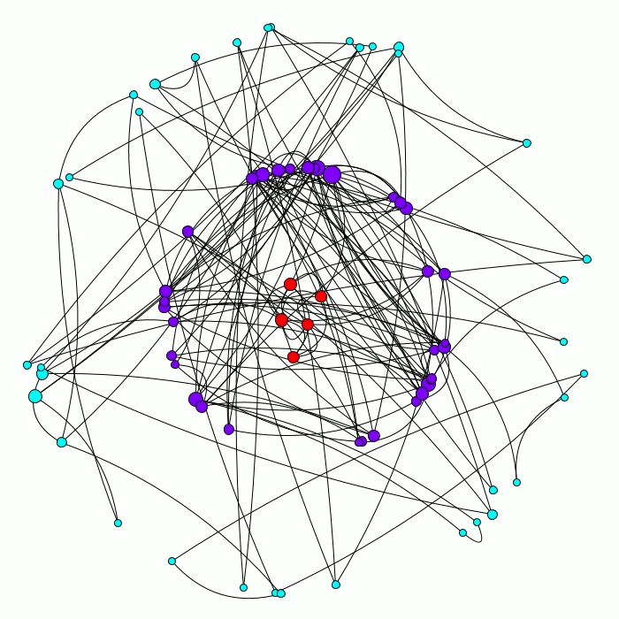
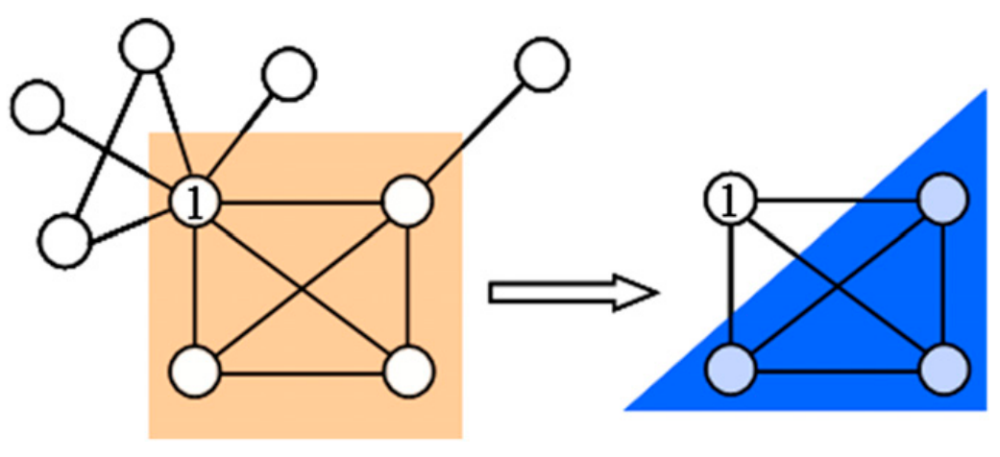
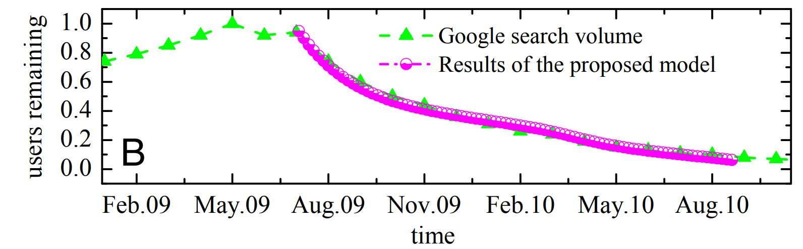
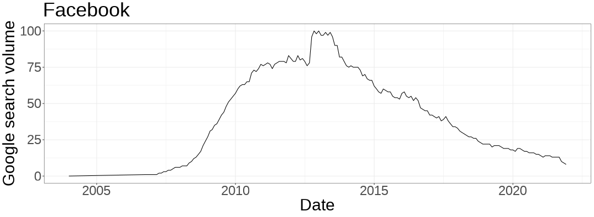
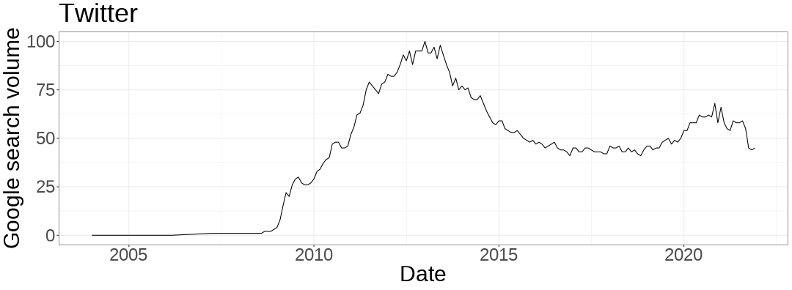

```{r xaringan-themer, include=FALSE, warning=FALSE}
#This block contains the theme configuration for the CSS lab slides style
library(xaringanthemer)
library(showtext)
style_mono_accent(
  base_color = "#5c5c5c",
  text_font_size = "1.5rem",
  header_font_google = google_font("Arial"),
  text_font_google   = google_font("Arial", "300", "300i"),
  code_font_google   = google_font("Fira Mono")
)
```

```{r setup, include=FALSE}
options(htmltools.dir.version = FALSE)
```

layout: true

<div class="my-footer"><span>David Garcia - Computational Modelling of Social Systems</span></div> 

---

## So far

- Basics of agent-based modelling
  - The micro-macro gap and the dating model
- Modelling segregation
  - Schelling's model and tolerance threshold
- Modelling cultures
  - Axelrod's model and ABM for Eurovision voting
- Modelling collective behavior
  - Granovetter's model and diversity-induced collective behavior
- Opinion dynamics
  - Polarization/fragmentation: Bounded confidence, IAS
- Small world models
  - Watts-Strogatz and the cavemen model
- Scale-free networks
  - Power-law degree distributions from growth, copying, and preference

---

# Overview

## 1. The death of social networks
## 2. Modelling online social network resilience
## 3. Empirical analysis of social network resilience


---

# The death of social networks

## *1. The death of social networks*
## 2. Modelling online social network resilience
## 3. Empirical analysis of social network resilience


---

# The question of social resilience
<div style="float:right">

</div>

> **Social Resilience:** The ability of a community to withstand external stresses, disturbances, and environmental changes

Nauru as an example of lack of resilience:

- Environmental shock in phosphate mining
- Loss of population and employment

What makes a society lose less or even gain from adversity?

---

# Why do online social networks collapse?

.center[]

[Friendster Was the Best Social Media Site, Ever. Yudhistira Agato, Vice (2017)](https://www.vice.com/en/article/ezjqzn/friendster-was-the-best-social-media-site-ever-1)

---
# The rise and fall of Friendster

**Friendster** went from 80 Million active users to disappear completely.


---

# The rise and fall of MySpace

**MySpace** went from being valued more than 12 Billion USD in 2008 to be bought by [Justin Timberlake for 35 Million USD](https://www.theguardian.com/technology/2011/jun/30/myspace-internet). 


---

# The rise and fall of Orkut

**Orkut** was the first attempt of Google to launch an online social network. It was very popular in some countries but lost users to Facebook and it was eventually taken offline.


---

# Modelling online social network resilience

## 1. The death of social networks
## *2. Modelling online social network resilience*
## 3. Empirical analysis of social network resilience


---

# Modelling social resilience online

Social resilience can be modelled as a process of how users stay active or inactive in a social networking site. 

If we consider social network users as rational, they will respond to incentives to stay active or to abandon social networks depending on **benefits and costs**.

**Benefits** can be quantified through the content users receive from their friends (shares, comments) and through the attention and support given by their friends (likes, votes).

A simple way to model monotonic benefits is proportionally to the active friends of a user $k_u$:

$$benefit_u = b * k_u$$
---

# Costs of using an online social network

<div style="float:right">

</div>
**Costs:** Using social network is not only benefits, there are also costs associated with being active, for example:  

- Time spent to learn to use the interface of the platform  
- Risks of disclosing personal information  
- Opportunity costs: you could be doing something else  
- Economic costs, for example membership fees.

A common assumption about costs is that they are relatively similar for all users, thus modeling them as a constant $c$. Then, a user will become inactive when the total benefits are below the cost:

$$ b *k_u < c $$

---
.center[]
---
.center[]
---
.center[]
---

# Iterative removal by degree

.center[]


---
# The k-core decomposition

The graph remaining after the cascade above is what is called a k-core

> **k-core**: A k-core of a graph $G$ is a maximal connected subgraph of $G$ in which all vertices have degree at least k.

For any network, you can calculate its k-core decomposition as follows:  

- Start with $k_s=1$  
- Remove all nodes with degree less than or equal to $k_s$ and their links  
- Repeat until all nodes have degree larger than $k_s$  
- Increase $k_s$ by one and repeat until no nodes are left

The nodes and the edges removed for certain of $k_s=k$ is called the **k-shell**.  
A **k-core** is the set of all k-shells with $k_s \geq k$.

---

# Coreness centrality

.center[]

The k-shell number of a node is also called **coreness centrality**.


Figure from [Kitsak et al.](https://www.nature.com/articles/nphys1746) Next session we will learn more about that work and how coreness is linked to spreading.
---

# Coreness and social resilience

The cost to benefit ratio $c/b$ defines a critical value of the degree $K$, below which users with degree $k_u<K$ will leave the social network. The remaining active social network is the k-core corresponding to $K$. The cumulative function of coreness values in the network serves as a **resilience function**:

.center[]


---

# Generalizing social resilience

.pull-left[
- The benefit function of a user can be more complex, for example as a calculation based on several properties of the user's social neighborhood.
- Yu et al. improved the model by adding a fraction $q$ of necessary friends to stay active as a condition. This models opportunity costs and alternatives. 
- Example: cascade when $k_s=3$ and $q=5$
]

.center[]

[System crash as dynamics of complex networks, Yi Yu, Gaoxi Xiao, Jie Zhou, Yubo Wang, Zhen Wang, Jürgen Kurths, and Hans Joachim Schellnhuber. PNAS (2016)](https://www.pnas.org/doi/10.1073/pnas.1612094113)
---

# Empirical analysis of social network resilience

## 1. The death of social networks
## 2. Modelling online social network resilience
## 3. Empirical analysis of social network resilience

---

# Backtesting with Friendster's collapse

.center[]
Constantly decreasing $k_s$ in simple k-core model. Inset: fraction of nodes with coreness below the median over the lifetime of Friendster.

---
# A better fit to Friendster's collapse
.center[]

- Running KQ cascades in which nodes do not always leave, they do so with probablity $f=0.15$
- Fit of KQ cascade with $k_s =20$, $q= 0.2$
- Similar model complexity but much more plausible model: 
  - need of $q$ and stochastic decision instead of worsening conditions

---

# Predicting Facebook's collapse

.pull-left[]
.pull-right[

- Cannarella and Spechler, 2014

- Epidemics model applied to the decay of online social networks

- Google trends to measure the number of active Facebook users

- Extrapolation predicted that Facebook would lose 80% of its users by 2017

]


[Epidemiological modeling of online social network dynamics. John Cannarella, Joshua A. Spechler. Arxiv preprint (2014)](https://arxiv.org/pdf/1401.4208v1.pdf)


---

# Stretching the Google trends method

Data scientists at Facebook [replied to the Arxiv paper](https://www.facebook.com/notes/mike-develin/debunking-princeton/10151947421191849/) showing the problem with measuring social network use levels using Google Trends data. Applying the same methodology, Facebook researchers reached the conclusion that Princeton would lose 80% of its students by 2021:


---

# Stretching the Google trends method

You can even apply it to air and come to the conclusion that the atmosphere will run out of air by 2060:


---

# Google trends for Facebook

The Facebook examples show that decrease in search volume is a decrease in information searching about the social network, not a decrease in access and use.




---

# Google trends for Twitter

Twitter is not living a second growth, in fact it's growth has been rather slow to stagnant for a few years, even though it appears it is gaining users after Trump's permanent suspension.




---

# Temporal validity issues

</br>
A more accurate way to measure activity in a social network is Bruno Ribeiro's [approach using Alexa data](https://dl.acm.org/doi/abs/10.1145/2566486.2567984), but Alexa focuses on website visits without considering access through mobile apps. 


</br>
Measurement is always an important issue in Computational Social Systems, and just because a paper used a measurement method few years ago, it does not mean it is valid today.

</br>
> **Take home message:** Your measures based on today's digital traces might not work on tomorrow's

---

# Summary

- The question of social resilience
  - Why do societies collapse?
  - Online social networks as the prime example of collapse


- Modelling social resilience as networked decisions
  - Modeling human decisions rather than disease spreading
  - A decision of a user leaving affects the situation of other users
  - This can be mapped to network metrics like coreness centrality


- Empirical analysis of online social resilience
  - Using trends as activity and sometimes social network data
  - Friendster collapse is better fitted by KQ model
  - Limits of google trends: the Facebook case