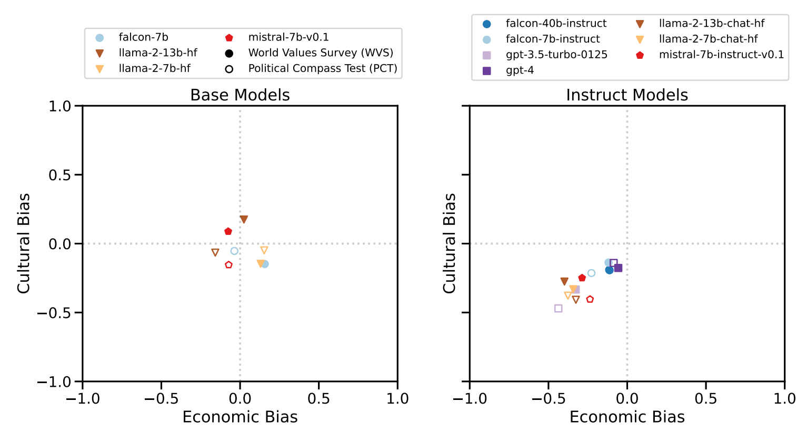
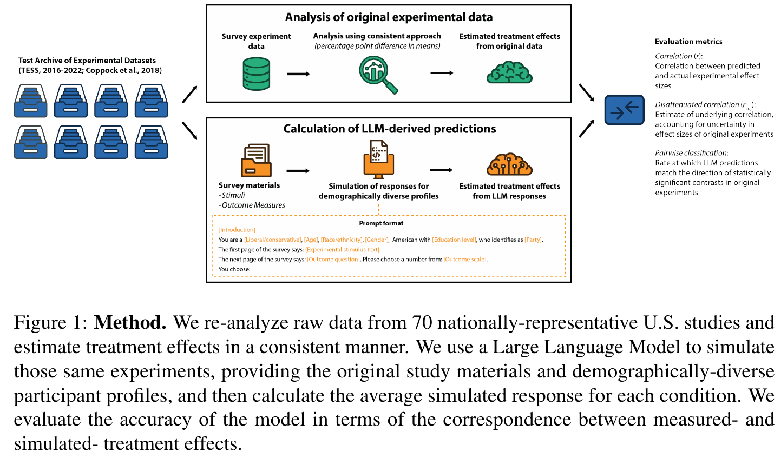

```{r xaringan-themer, include=FALSE, warning=FALSE}
#This block contains the theme configuration for the CSS lab slides style
library(xaringanthemer)
library(showtext)
style_mono_accent(
  base_color = "#5c5c5c",
  text_font_size = "1.5rem",
  header_font_google = google_font("Arial"),
  text_font_google   = google_font("Arial", "300", "300i"),
  code_font_google   = google_font("Fira Mono")
)
```

```{r setup, include=FALSE}
options(htmltools.dir.version = FALSE)
```

layout: true

<div class="my-footer"><span>David Garcia - Computational Modelling of Social Systems</span></div> 

---

## So far

- Basics of agent-based modelling: the micro-macro gap
- Modelling segregation: Schelling's model
- Modelling cultures: Axelrod's model
- Basics of spreading: Granovetter's threshold model
- Opinion dynamics
- Modelling small worlds
- Scale-free networks

---

# Overview

## 1. Social simulacra

## 2. Behavioral research on LLMs

## 3. Representing populations with LLMs

## 4. Experiment effects with LLMs

---

<br>
<br>
<br>
# 1. Social simulacra

[Generative Agents: Interactive Simulacra of Human Behavior](https://dl.acm.org/doi/abs/10.1145/3586183.3606763)


[Social Simulacra: Creating Populated Prototypes for Social Computing Systems](https://dl.acm.org/doi/pdf/10.1145/3526113.3545616)

---
# Simulacra and simulation    

.pull-left[.center[]]

The Matrix (1999)

---

[Generative Agents: Interactive Simulacra of Human Behavior. JS Park et al.](https://dl.acm.org/doi/abs/10.1145/3586183.3606763)

.center[]

---
# A generative agent design

.center[]

---

# Social behavior examples
.center[]

---
[Social Simulacra: Creating Populated Prototypes for Social Computing Systems. JS Park et al.](https://dl.acm.org/doi/pdf/10.1145/3526113.3545616)

.center[]

---
# Simulating subreddits with LLM agents
.center[]

---
# Experiment: SimReddit vs Crowdworkers
.center[]

---

<br>
<br>
<br>
# 2. Behavioral research on LLMs


[AI Psychometrics: Assessing the Psychological Profiles of Large Language Models Through Psychometric Inventories.](https://journals.sagepub.com/doi/full/10.1177/17456916231214460)


[Only a Little to the Left: A Theory-grounded Measure of Political Bias in Large Language Models](https://arxiv.org/abs/2503.16148)

---

[AI Psychometrics: Assessing the Psychological Profiles of Large Language Models Through Psychometric Inventories. Max Pellert et al.](https://journals.sagepub.com/doi/full/10.1177/17456916231214460)

.center[]

--- 

# Personality of Transformer Models
.center[]

---

# Moral foundations of AI and moderates
.center[]

---

[Political Compass or Spinning Arrow? Towards More Meaningful Evaluations for Values and Opinions in Large Language Models. Röttger et al.](https://arxiv.org/pdf/2402.16786)

.pull-left[]
.pull-right[]

---

[Only a Little to the Left: A Theory-grounded Measure of Political Bias in Large Language Models](https://arxiv.org/abs/2503.16148)


.pull-left[]
.pull-right[]

Aims:
1. Use a validated survey measurement: social and economic items from World Values Survey
2. Analyze LLM output as text: classification with a transformers model into agree/disagree/neither

---

# Testing prompt robustness

.pull-left[]
.pull-right[]

---

# Ideology in LLMs
.center[]


---
# Prompt effect examples
.center[]


---
<br>
<br>
<br>
# 3. Representing populations with LLMs

[Out of One, Many: Using Language Models to Simulate Human Samples](https://www.cambridge.org/core/journals/political-analysis/article/abs/out-of-one-many-using-language-models-to-simulate-human-samples/035D7C8A55B237942FB6DBAD7CAA4E49)

[Synthetic Replacements for Human Survey Data? The Perils of Large Language Models](https://www.cambridge.org/core/journals/political-analysis/article/synthetic-replacements-for-human-survey-data-the-perils-of-large-language-models/B92267DC26195C7F36E63EA04A47D2FE)


---
[Out of One, Many: Using Language Models to Simulate Human Samples. Lisa Argyle et al.](https://www.cambridge.org/core/journals/political-analysis/article/abs/out-of-one-many-using-language-models-to-simulate-human-samples/035D7C8A55B237942FB6DBAD7CAA4E49)

.center[]

---
# Comparing generated words by partisans
.pull-left[]
.pull-right[]

---
.center[]

---

# GPT-3 vs ANES

.center[]

---

# GPT-3 vs ANES

.center[]

---


[Synthetic Replacements for Human Survey Data? The Perils of Large Language Models. James Bisbee et al.](https://www.cambridge.org/core/journals/political-analysis/article/synthetic-replacements-for-human-survey-data-the-perils-of-large-language-models/B92267DC26195C7F36E63EA04A47D2FE)

.center[]

---

# Prompting for ANES thermometers

.center[]

---

# The problem of low variance

.center[]

---
# Low variance among groups

.center[]

---

# Only politics matters in the persona

.center[]

---
[Missing the Margins: A Systematic Literature Review on the Demographic Representativeness of LLMs. Indira Sen et al.](https://osf.io/vk3x6/download)


.center[]

---

<br>
<br>
<br>
# 4. Experiment effects with LLMs

[Using Large Language Models to Simulate Multiple Humans and Replicate Human Subject Studies](https://proceedings.mlr.press/v202/aher23a.html)

[Prediciting Results of Social Science Experiments Using Large Language Models](https://docsend.com/view/ity6yf2dansesucf)

---

[Using Large Language Models to Simulate Multiple Humans and Replicate Human Subject Studies. Aher et al.](https://proceedings.mlr.press/v202/aher23a.html)


.pull-left[]
.pull-right[]


---
# Replicating Milgram's experiment
.center[]

---
[Prediciting Results of Social Science Experiments Using Large Language Models. Ashokkumar et al.](https://docsend.com/view/ity6yf2dansesucf)

.center[]

---
# Real and simulated effect sizes

.center[]

---

# Simulating unpublished papers

.center[]

---

# Group effects but not heterogeneity

.center[]

---


# Two papers for next week

.pull-left[

[Simulating Social Media Using Large Language Models to Evaluate Alternative News Feed Algorithms. Petter Törnberg, Diliara Valeeva, Justus Uitermark, Christopher Bail.](https://arxiv.org/abs/2310.05984)]


.pull-right[
[OASIS: Open Agent Social Interaction Simulations with One Million Agents. Ziyi Yang et al.](https://arxiv.org/abs/2411.11581)
]


